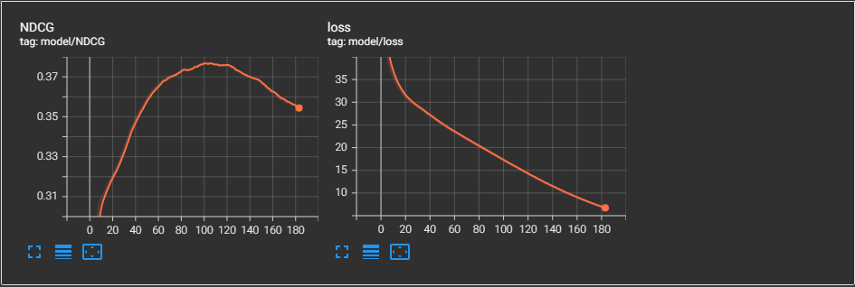

# LightGCN-with-CrossEntropyLoss

A PyTorch implementation of LightGCN with cross entropy loss.

# Usage

1. Download the processed dataset from [RecBole]([Dataset Download — RecBole 0.2.0 documentation](https://recbole.io/docs/user_guide/data/dataset_download.html)) (RecBole is a unified, comprehensive and efficient framework developed based on PyTorch).

2. Train the model and predict.

   ```
   cd src && python main.py
   ```

# Result



# Reference

1. [RecBole v1.0.0 — RecBole 0.2.0 documentation](https://recbole.io/docs/)
2. [gusye1234/LightGCN-PyTorch: The PyTorch implementation of LightGCN (github.com)](https://github.com/gusye1234/LightGCN-PyTorch)
3. He, X., Deng, K., Wang, X., Li, Y., Zhang, Y., & Wang, M. (2020). LightGCN: Simplifying and Powering Graph Convolution Network for Recommendation. *Proceedings of the 43rd International ACM SIGIR Conference on Research and Development in Information Retrieval*.


